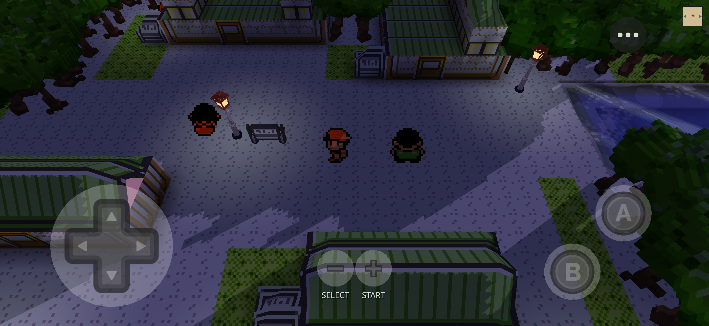
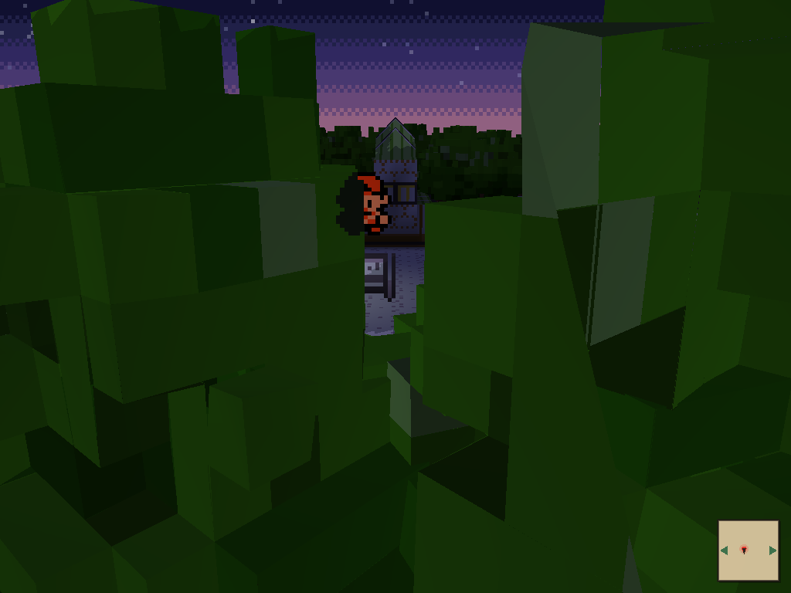
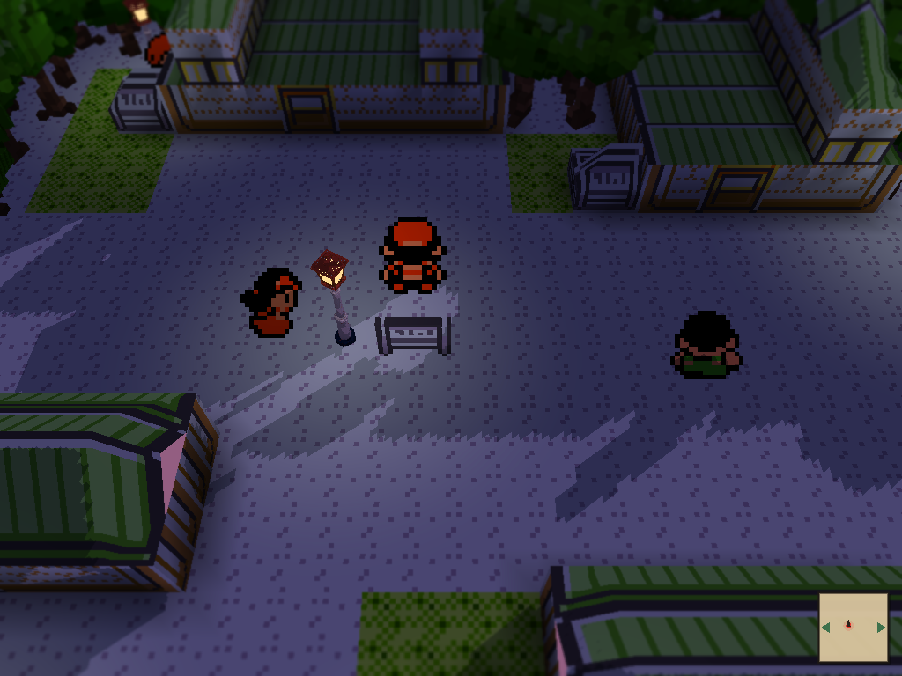

# Terrarium for Pokémon Crystal

Gen 2 support for the [Terrarium](https://github.com/BrenoBertucci/Terrarium)
voxel-diorama mod on the [gen1recomp](https://github.com/bryanthaboi/gen1recomp)
engine: Johto's towns, routes, caves and interiors rendered as a 3D voxel
world — on **iOS** as well as desktop.



*New Bark Town at night, running on an iPhone.*

Terrarium was written for Red / Blue / Yellow. Booting it on Crystal drew every
town as a solid mass of trees, because the engine's Gen 2 games describe their
maps completely differently (collision bytes and GBC palettes instead of Gen 1
tile ids). This kit teaches Terrarium to read Gen 2 maps, and patches the two
things in the engine's iOS build that stood in the way of running it on a
phone at all.

| | Before | After |
|---|---|---|
| New Bark Town |  |  |

## Compatibility

| | Status |
|---|---|
| **Game** | **Pokémon Crystal (USA) Rev 1.1** — SHA-1 `f2f52230b536214ef7c9924f483392993e226cfb`. Tested. Crystal Rev 1.0 should work (same tilesets) but is untested. Gold / Silver: untested — the kit leaves them on Terrarium's own Gold behaviour. |
| **Engine** | gen1recomp **v0.2.60** (`4dadfd55`). The engine patches are written against that tag. |
| **Mod base** | Terrarium at commit **`ffecfa14`** (1.36.0-beta, 2026-09-15). |
| **iOS** | **Tested**: iPhone 16 Pro Max, iOS 26.1, LÖVE 12 / Metal, portrait and landscape ([phone](screenshots/new-bark-town-iphone.png), [Simulator](screenshots/new-bark-town-ios-simulator.png)). You build the app yourself — see below. |
| **macOS** | Tested with the official gen1recomp macOS build (LÖVE 11.5 / OpenGL). No engine patch needed on desktop. |
| **Android / Windows / Linux** | Untested. The mod changes are platform-neutral; the engine patches are iOS-specific. |

**This repository contains no ROM, no save, no extracted game data and no
Nintendo-owned art.** You need your own, legally obtained cartridge dump; the
engine rebuilds everything from it on your device and verifies the SHA-1.

## What you get

- The voxel overworld on Crystal: forest borders as canopies, houses with
  roofs in each town's own colour, doors folded into facades, signs, lamps,
  fences, ledges, tall grass, sea and cave water, interiors (Elm's lab, caves).
- Terrarium's shadows, tilt-shift, day/night and camera ladder as on Kanto.
- Correct rendering on iOS (Metal): upright, centred on the player, in either
  orientation.

Not (yet) ported: Terrarium's on-map battles, wild roamers, weather, ecology
and the rest of its Kanto-specific features are **untested on Gen 2**; battles
use the engine's own 2D screen. The optional RTX pass is untested on Metal.

## What is in this repository

```
apply.sh                       fetches the pinned engine + mod, applies everything, builds the mod package
patches/engine/                two patches for gen1recomp v0.2.60 (iOS builds)
patches/terrarium/             one patch for Terrarium ffecfa14 (its own files)
overlay/terrarium/             NEW files added to Terrarium (the Gen 2 classifier, probes, tools)
docs/INSTALL.md                step by step, iOS and desktop
docs/HOW-IT-WORKS.md           what was wrong and what each change does
docs/TESTING.md                the headless probes and the Simulator workflow
screenshots/                   renders from this kit (game footage)
```

Terrarium and gen1recomp are **not** redistributed here (Terrarium carries no
licence; see [CREDITS.md](CREDITS.md)). `apply.sh` fetches each from its own
repository at the pinned revision and applies the patches on your machine.

## Quick start

```sh
git clone https://github.com/<you>/terrarium-gen2-crystal
cd terrarium-gen2-crystal
./apply.sh            # -> work/gen1recomp (patched), work/Terrarium (patched), dist/TERRARIUM.zip
```

Then follow [docs/INSTALL.md](docs/INSTALL.md):

1. **iOS**: build and install the patched engine with gen1recomp's own
   `scripts/build_ios.sh` (needs a Mac with Xcode and an Apple ID — a free one
   works with a 7-day re-sign, a paid Developer Program membership gives a
   year). The App Store / AltStore builds of gen1recomp will **not** do: the
   Gold rendering fix lives in the app.
2. Import your Crystal dump in the launcher.
3. Put `dist/TERRARIUM/` in the app's `mods/` folder (or import the zip).
4. Set the camera once in `options.lua`: `gold = { pipelines = { terrarium_voxel = 3 } }`.
   Crystal's OPTIONS menu has no row for it.

## Camera levels

`terrarium_voxel`: `1` FULL (top-down), `2` 15°, `3` 35° (recommended), `4` 50°,
`5` 75°. `0` off.

## Known issues

- A one-pixel seam on the end faces of some houses.
- Very large forests (Ilex) exceed the authored-tree budget and fall back to
  plain voxel hulls.
- The steepest camera level looks blocky up close.

## Related work

[UNDERdecoded/Gen2Recomped](https://github.com/UNDERdecoded/Gen2Recomped) is a
separate fork of the engine built for Gen 2, with
[its own Dramatic Shape adaptation](https://github.com/UNDERdecoded/Gen2Recomped-DramaticShapes)
that includes 3D battles. This kit is the other route: the upstream engine,
the Terrarium fork, Crystal.

## Licence

The files this repository adds (`overlay/`, `apply.sh`, `docs/`) are MIT
([LICENSE](LICENSE)). The patches are diffs against third-party files and are
provided for interoperability; the files they modify remain under their
authors' terms. See [CREDITS.md](CREDITS.md).

Pokémon is a trademark of Nintendo / Creatures Inc. / GAME FREAK Inc. This
project is not affiliated with, endorsed by or associated with them, nor with
`gen1recomp[.]com` (an impersonator site — the engine lives on GitHub).
